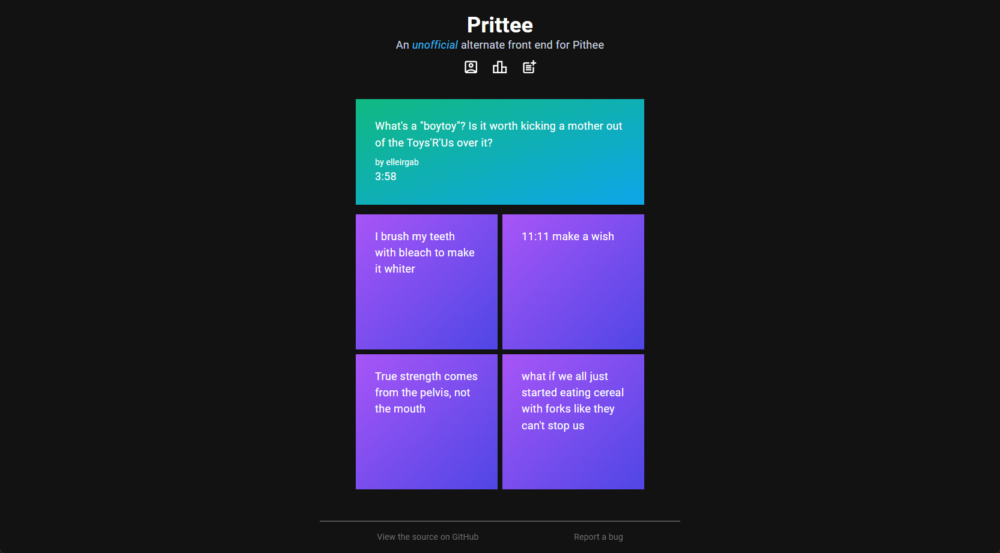

# Prittee

Prittee is an unofficial, experimental alternate front end for Pithee, the site Jacksfilms recent launched. I made Prittee because I noticed some small UI/UX issues I thought could be fixed to improve the user experience of the site (most notably, the time it takes to load more posts after voting for one).

Prittee has some limitations due to it being an unofficial site, such as the fact that you can only be logged in for an hour at a time, so I don't expect this to replace the official Pithee site for people's pith-ing needs. This was mostly made as an exercise for me.

The site is made in React, using React Router v6.